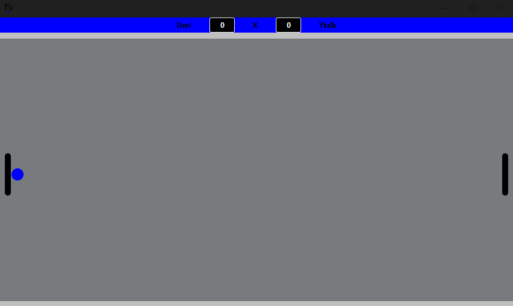
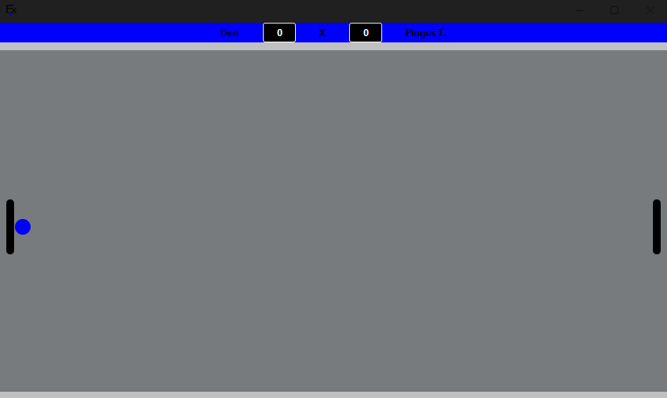
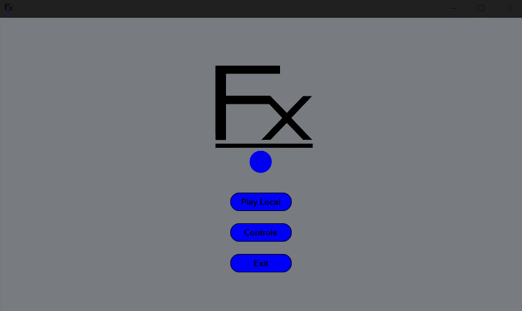
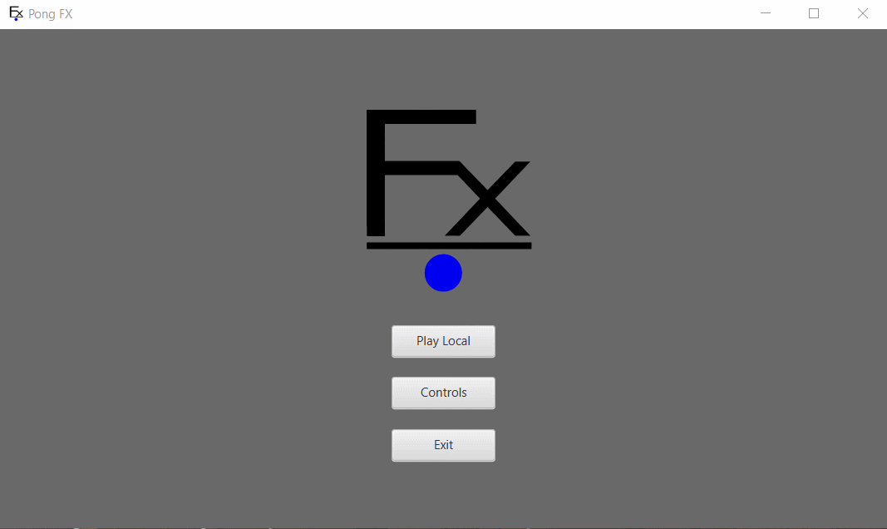

<h1 align="center">
    
    <p>Pong FX</p>
</h1>


## 🏓 About

**Pong FX** is a project with the aim of taking advantage of the holidays to develop ping pong (online and offline) in Java, organized in Maven. It uses JavaFX and JFoenix libraries, in addition to the Spring Boot framework. The game must contain local mode, and online with a room system hosted on a website. Varied game mechanics/modes and match customization.


- Demo with PvP: It is “Control 1” that starts playing the match, and when a player scores, the opponent will have control of the ball. Once the objective score is reached, a pop-up will inform you who won, and when you click “OK” you are redirected to the menu.


- Demo against bot: Depending on the direction the racket is going when it collides with the ball this will affect the Y axis of the ball.


- Interface to organize a match.


- Game controls information.


## 🔨 Tools

- [Java](https://docs.oracle.com/en/java/)
- [JavaFX](https://openjfx.io)
- [Maven](https://maven.apache.org)
- [JFoenix](https://github.com/sshahine/JFoenix)

## 📄 Dependencies

- [`Java JDK 9+`](https://www.oracle.com/java/technologies/downloads/) (mandatory)
- [`Make`](https://gnuwin32.sourceforge.net/packages/make.htm) (optional)

## 💿 How Contribute

```bash
#Clone the project
$ git clone https://github.com/Ytalk/ping-pong.git
```

```bash
#Enter directory
$ cd ping-pong
```

```bash
#Run with makefile

#Linux:
$ make lpermission
$ make run

#Windows:
$ make run
```

<p align = "center">or</p>

```bash
#Run without makefile

#Linux:
$ chmod +x mvnw
$ ./mvnw javafx:run

#Windows:
$ ./mvnw javafx:run
```